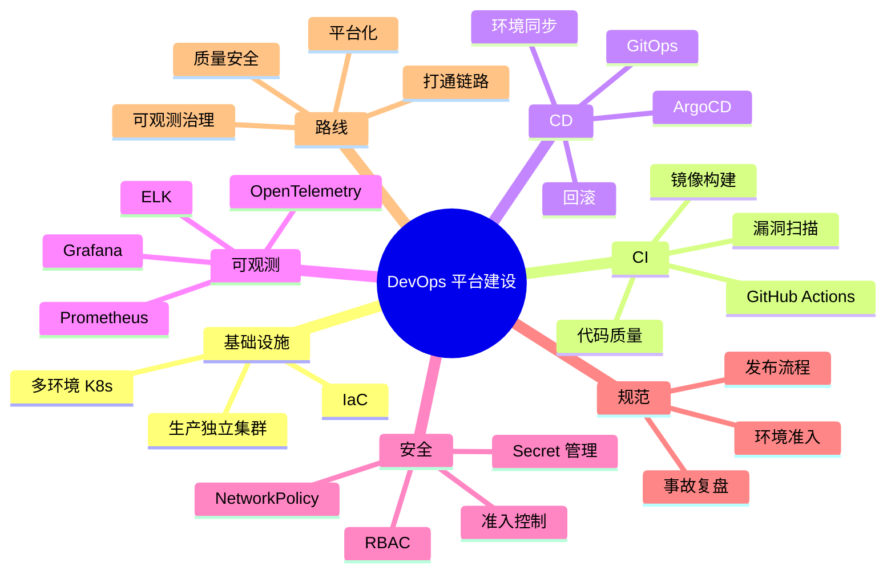

# DevOps 平台建设方案

面向多环境 Kubernetes、GitHub Actions CI、GitOps CD、可观测与安全治理的一体化建设蓝图。

## 1. 建设目标

本方案用于建设一套标准化、自动化、可观测、可审计、可回滚、安全前置的 DevOps 平台体系，覆盖从代码提交、持续集成、镜像构建、安全扫描、持续部署到运行监控和发布治理的完整链路。

核心目标：

- 建立研发、测试、预发、生产隔离的运行环境，生产集群独立管理。
- 建立从代码提交到镜像构建、扫描、部署、回滚的自动化链路。
- 建立面向应用、平台、基础设施的可观测能力。
- 将安全检查前移到 CI、准入控制和运行时边界。
- 用 IaC、GitOps、发布规范和环境准入标准形成可审计的工程制度。

## 2. 总体架构

平台整体采用：

```text
业务代码仓库
  -> GitHub Actions CI
  -> 镜像仓库
  -> GitOps 仓库
  -> ArgoCD
  -> 多环境 Kubernetes 集群
  -> Prometheus / ELK / OpenTelemetry / 安全策略
```

职责边界：

| 模块 | 职责 | 设计要点 |
|---|---|---|
| 代码仓库 | 业务代码、Dockerfile、测试脚本、CI 工作流 | PR 触发质量门禁 |
| GitHub Actions | 代码检查、单元测试、镜像构建、漏洞扫描、推送镜像 | CI 只生成产物和更新部署声明，不直接改生产集群 |
| 镜像仓库 | 保存版本化镜像，配合扫描与签名策略 | 生产禁止 `latest`，推荐版本号 + Git SHA |
| GitOps 仓库 | Helm values、Kustomize overlay、ArgoCD Application | 环境变更可审计、可审批、可回滚 |
| ArgoCD | 持续部署、多集群同步、漂移检测、部署审计 | 生产同步需审批或受 Sync Window 控制 |
| K8s 集群 | 承载应用、Ingress、服务发现、资源隔离 | 生产独立集群，非生产按预算选择独立或共享 |

推荐仓库拆分：

```text
app-repo/
  src/
  Dockerfile
  .github/workflows/

gitops-repo/
  argocd-apps/
    root-app.yaml
    dev/
    test/
    staging/
    prod/
  charts/
  environments/
    dev/
    test/
    staging/
    prod/
```

## 3. 基础设施规划

| 环境 | 定位 | 集群建议 | 关键要求 |
|---|---|---|---|
| Dev | 研发联调、快速验证 | 可共享集群或独立命名空间 | 自动部署，允许快速迭代 |
| Test | QA、集成测试、自动化测试 | 建议独立命名空间或独立集群 | 测试门禁与测试数据隔离 |
| Staging | 发布前最终验证 | 尽量贴近生产 | 配置、拓扑、依赖版本接近生产 |
| Prod | 正式业务流量 | 独立 K8s 集群 | 独立权限、网络、密钥、监控与发布审批 |

基础设施设计要求：

- 生产集群独立于非生产集群，独立 VPC、节点池、Ingress/Gateway、镜像拉取权限和密钥域。
- 非生产环境可按成本采用同集群多 namespace 模式，但必须配置 `ResourceQuota`、`LimitRange`、RBAC 和 `NetworkPolicy`。
- 关键系统组件使用独立命名空间，例如 `argocd`、`monitoring`、`logging`、`ingress`、`security`。
- 节点池按工作负载分层：系统组件、普通业务、计算密集、状态服务或 GPU 等特殊资源。

IaC 与配置管理：

- 云资源使用 Terraform 管理，模块化拆分网络、集群、节点池、数据库、缓存、DNS、证书等资源。
- Kubernetes 应用使用 Helm 或 Kustomize 管理，避免手工维护散落的 YAML。
- 所有基础设施和部署配置变更必须通过 PR，生产变更必须经过审批。
- 禁止直接在生产集群手工修改对象；若临时修复不可避免，事后必须回写 GitOps 仓库。

## 4. CI 持续集成规划

CI 层由 GitHub Actions 承担，目标是把质量、安全和可部署性尽量前置到代码合并前和镜像发布前。

| 流水线 | 主要动作 | 目标 |
|---|---|---|
| Pull Request | 格式检查、Lint、单元测试、依赖扫描、IaC 扫描 | 阻止低质量代码进入主干 |
| Main 分支 | 构建镜像、生成 tag、镜像扫描、推送 Registry | 形成可部署产物 |
| Release | 生成版本、变更记录、更新 GitOps、触发预发部署 | 支撑正式发布流程 |
| Hotfix | 紧急修复构建、快速扫描、更新指定环境 | 保证应急发布仍可审计 |

CI 标准步骤：

1. 拉取代码并恢复依赖缓存。
2. 执行格式检查、静态检查、单元测试和覆盖率检查。
3. 执行依赖漏洞扫描、Dockerfile 检查和 IaC 配置扫描。
4. 构建容器镜像并打上版本号、Git SHA、构建时间等标签。
5. 执行镜像漏洞扫描和镜像元数据校验。
6. 推送镜像到可信镜像仓库。
7. 按环境策略更新 GitOps 仓库中的镜像版本或发布声明。

镜像与版本规范：

- 镜像 tag 推荐采用“业务版本 + Git SHA”，例如 `order-service:v1.8.2-a13f91c`。
- 生产环境禁止使用 `latest` 或不可追溯 tag。
- 镜像必须带有 OCI Label：版本、提交号、构建时间、仓库地址、维护团队。
- 高安全要求场景建议引入镜像签名，例如 Cosign，并在准入控制阶段校验签名。

## 5. CD 与 GitOps 规划

CD 层采用 GitOps 架构，ArgoCD 负责持续部署和状态同步。所有环境的期望状态都保存在 GitOps 仓库中，集群内实际状态由 ArgoCD 对比并同步。

| 环境 | 同步策略 | 触发方式 | 治理重点 |
|---|---|---|---|
| Dev | 自动同步 | 代码合并后可自动更新镜像版本并部署 | 快速反馈 |
| Test | 自动或半自动 | 测试任务通过后同步 | 保证 QA 稳定性 |
| Staging | 受控自动 | Release tag 或 release 分支触发 | 验证生产发布候选版本 |
| Prod | 人工审批 | PR 审批 + ArgoCD 手动 Sync 或 Sync Window | 确保生产可控 |

发布策略：

- 普通服务默认滚动发布，结合 `readinessProbe` 避免未就绪实例接流量。
- 核心服务支持灰度、蓝绿或金丝雀发布，可结合 Argo Rollouts 或服务网格实现流量分配。
- 所有生产发布必须具备回滚路径：回滚镜像版本、回滚 GitOps commit、回滚配置变更。
- 发布窗口、冻结期、审批人、验证人和回滚负责人必须明确记录。

## 6. 可观测体系规划

| 能力 | 推荐组件 | 建设内容 |
|---|---|---|
| 指标 | Prometheus、Grafana、Alertmanager | 资源、应用、业务指标、SLO、告警 |
| 日志 | ELK 或 EFK | 应用日志、Ingress 日志、K8s 事件、审计日志 |
| 链路追踪 | OpenTelemetry、Jaeger 或 Tempo | Trace ID 贯通服务调用、日志和告警 |
| 事件与审计 | K8s Audit、ArgoCD Event、CI/CD 审计 | 变更追踪与事故复盘 |

监控指标分层：

- 平台层：节点 CPU、内存、磁盘、网络、Pod 重启、调度失败、集群组件健康度。
- 应用层：请求量、错误率、延迟、队列堆积、连接池、缓存命中率。
- 业务层：订单量、支付成功率、任务完成率、核心转化率等与业务目标直接相关的指标。
- SLO 层：可用性、P95/P99 延迟、错误预算消耗和关键接口健康度。

日志与 Trace 规范：

- 应用日志统一输出 JSON，包含 `timestamp`、`level`、`service`、`env`、`trace_id`、`span_id`、`message`。
- 所有入口请求生成或透传 `trace_id`，并在日志、链路追踪和错误上报中保持一致。
- 日志保留周期按环境区分，生产关键审计日志建议长期归档。
- 告警应能跳转到相关 Dashboard、日志查询和 Trace 视图。

## 7. 安全防线规划

| 安全域 | 能力 | 治理目标 |
|---|---|---|
| 供应链安全 | 依赖扫描、镜像扫描、镜像签名、SBOM | 在 CI 阶段拦截高危漏洞 |
| 权限安全 | RBAC、最小权限、命名空间隔离 | 按团队、环境、角色授权 |
| 网络安全 | NetworkPolicy、Ingress 控制、默认拒绝 | 限制服务横向访问 |
| 密钥安全 | Vault、External Secrets、云 Secret Manager | 避免密钥进入代码和镜像 |
| 准入控制 | OPA Gatekeeper 或 Kyverno | 强制执行平台策略 |
| 运行时安全 | Pod Security、审计日志、异常检测 | 减少容器逃逸和误操作风险 |

生产准入策略：

- 禁止 privileged 容器，禁止 root 用户运行，必须配置只读根文件系统或明确豁免。
- 必须配置 `requests`、`limits`、`readinessProbe`、`livenessProbe`。
- 必须使用固定镜像 tag，禁止 `latest`。
- 必须通过镜像漏洞扫描，高危漏洞需修复或审批豁免。
- 必须配置必要的 `NetworkPolicy`，默认拒绝非必要东西向访问。
- Secret 不得明文写入 Git 仓库，必须通过密钥管理系统注入。

## 8. 规范体系

| 规范 | 要求 | 价值 |
|---|---|---|
| 分支规范 | `main`、`release`、`hotfix`、`feature` 分支按用途管理 | 保障代码流向清晰 |
| PR 规范 | 代码评审、自动检查、关联需求或缺陷 | 形成质量门禁 |
| 发布规范 | 预发验证、审批、灰度、监控确认、回滚预案 | 降低生产风险 |
| IaC 规范 | 所有基础设施变更通过 Terraform/Helm/Kustomize 和 PR | 保障可审计和可回滚 |
| 环境准入 | 不同环境设定不同准入条件 | 避免低质量服务进入高等级环境 |
| 事故复盘 | 故障分级、响应时间、根因分析、改进项闭环 | 持续改进稳定性 |

环境准入标准：

| 环境 | 准入条件 |
|---|---|
| Dev | 服务可构建、可启动、基础健康检查通过 |
| Test | 单元测试、集成测试、接口测试和依赖扫描通过 |
| Staging | 配置接近生产、回归测试通过、关键链路验证通过 |
| Prod | 安全扫描通过、审批完成、监控看板就绪、回滚方案明确 |

## 9. 组织职责与协作机制

| 角色 | 职责 |
|---|---|
| 平台工程团队 | 建设和维护 CI/CD 模板、K8s 基础设施、ArgoCD、监控日志平台、安全策略 |
| 研发团队 | 维护应用代码、Dockerfile、测试、服务配置，按规范提交 PR 和发布申请 |
| SRE/运维团队 | 负责生产稳定性、容量管理、告警响应、故障复盘和运行时治理 |
| 安全团队 | 制定漏洞等级、准入策略、密钥规范、审计要求和豁免流程 |
| 测试团队 | 建设自动化测试、回归测试、环境验证和发布准入测试标准 |

## 10. 分阶段落地路线

| 阶段 | 目标 | 重点建设内容 | 周期建议 |
|---|---|---|---|
| 阶段一 | 打通主链路 | K8s 环境、镜像仓库、GitHub Actions、ArgoCD、示范服务 | 1-4 周 |
| 阶段二 | 质量与安全前置 | Lint、测试门禁、漏洞扫描、RBAC、NetworkPolicy、Secret 管理 | 4-8 周 |
| 阶段三 | 可观测与发布治理 | Prometheus、Grafana、ELK、Trace、告警、发布审批、回滚演练 | 8-12 周 |
| 阶段四 | 平台化与规模化 | 服务模板、多集群治理、策略准入、自动化环境、DevOps 门户 | 12 周以后 |

阶段验收标准：

- 至少一个示范服务完成从 PR、CI、镜像构建、镜像扫描到 ArgoCD 部署的闭环。
- Dev、Test、Staging、Prod 至少形成清晰环境边界和部署路径。
- 生产发布不再依赖人工 `kubectl apply`，所有变更可在 Git 中追踪。
- 主要服务接入统一 CI 模板，核心安全检查成为强制门禁。
- 生产服务具备标准 Dashboard、告警规则、日志检索和 Trace 关联能力。
- 新服务可通过模板快速接入，平台能力从项目级扩展到组织级。

## 11. 风险与应对

| 风险 | 表现 | 应对措施 |
|---|---|---|
| 工具堆叠但流程未落地 | 只部署组件，不改变发布和协作方式 | 以示范服务打通端到端流程，再复制推广 |
| 生产配置漂移 | 手工修改集群导致 Git 与实际状态不一致 | ArgoCD 漂移检测，禁止手工改生产，紧急修复后必须回写 Git |
| 安全门禁影响效率 | 扫描误报或策略过严导致发布受阻 | 建立漏洞分级、豁免审批和基线例外机制 |
| 可观测数据不可用 | 指标、日志、Trace 分散或字段不统一 | 统一埋点、日志字段和 Dashboard 标准 |
| 多集群治理复杂 | 集群数量增长后配置重复和权限混乱 | GitOps 模板化、环境 overlay、集中身份和权限策略 |

## 12. 平台建设交付物清单

- Kubernetes 多环境集群与命名空间规划。
- GitHub Actions CI 模板与示范服务流水线。
- GitOps 仓库结构、ArgoCD App of Apps 配置和环境 values 模板。
- 镜像仓库、镜像扫描、版本规范和发布 tag 规范。
- Prometheus/Grafana 监控体系、ELK 日志体系、OpenTelemetry 链路追踪规范。
- RBAC、NetworkPolicy、Secret 管理、准入控制和生产安全基线。
- 发布流程、回滚流程、环境准入规范、事故响应和复盘模板。
- 平台运营手册、服务接入手册和验收标准。

## 13. 推荐技术选型

| 领域 | 推荐组件 | 用途 |
|---|---|---|
| 容器编排 | Kubernetes | 多环境应用运行与资源编排 |
| CI | GitHub Actions | 代码检查、测试、构建、扫描 |
| CD | ArgoCD | GitOps 持续部署和多集群同步 |
| 配置管理 | Helm / Kustomize | 应用模板化与环境差异管理 |
| IaC | Terraform | 云资源和基础设施声明式管理 |
| 指标监控 | Prometheus + Grafana + Alertmanager | 指标采集、展示和告警 |
| 日志 | ELK / EFK | 日志采集、检索、归档 |
| Trace | OpenTelemetry + Jaeger/Tempo | 分布式链路追踪 |
| 镜像扫描 | Trivy / Grype | 镜像与依赖漏洞扫描 |
| 策略准入 | OPA Gatekeeper / Kyverno | K8s 策略校验与准入控制 |
| 密钥管理 | Vault / External Secrets / 云 Secret Manager | 密钥托管与动态注入 |

## 14. 思维导图


