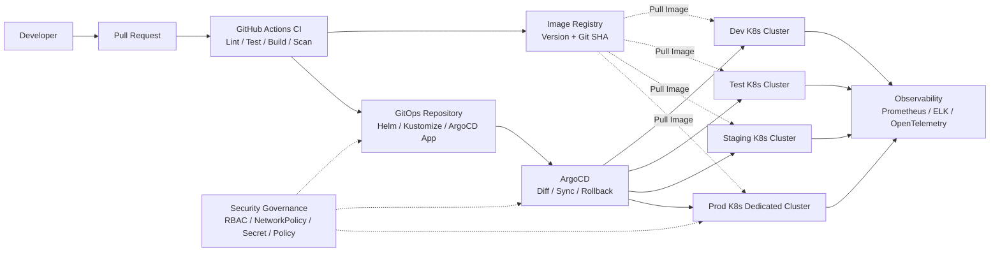
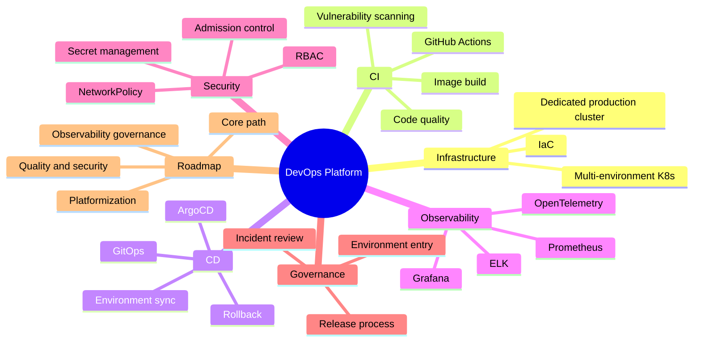

# DevOps Platform Blueprint

[中文版本](README.zh-CN.md)

A practical DevOps platform blueprint for multi-environment Kubernetes, GitHub Actions CI, GitOps-based continuous delivery, observability, security controls, and engineering governance.

## 1. Goals

This blueprint describes a standardized, automated, observable, auditable, rollback-friendly, and security-aware DevOps platform. It covers the full delivery path from code submission, CI validation, image build, vulnerability scanning, GitOps deployment, runtime monitoring, and release governance.

Core goals:

- Isolate development, test, staging, and production environments, with production running in a dedicated Kubernetes cluster.
- Automate the path from code commit to image build, scan, deployment, and rollback.
- Build observability across applications, platform components, and infrastructure.
- Shift security checks left into CI, admission control, and runtime boundaries.
- Use IaC, GitOps, release rules, and environment entry criteria to make changes auditable and repeatable.

## 2. Architecture

The platform uses GitHub Actions + GitOps + ArgoCD as the main delivery model. The diagram below is rendered directly by GitHub Markdown.



Responsibility boundaries:

| Module | Responsibility | Design Notes |
|---|---|---|
| Application repository | Source code, Dockerfile, tests, CI workflows | Pull requests trigger quality gates |
| GitHub Actions | Lint, unit tests, image build, vulnerability scan, image push | CI produces artifacts and updates deployment declarations; it should not directly mutate production |
| Image registry | Stores versioned images with scan and signing metadata | Production must not use `latest`; prefer semantic version + Git SHA |
| GitOps repository | Helm values, Kustomize overlays, ArgoCD Applications | Environment changes are auditable, reviewable, and rollback-friendly |
| ArgoCD | Continuous deployment, multi-cluster sync, drift detection, deployment audit | Production sync should require approval or sync-window control |
| Kubernetes clusters | Application runtime, ingress, service discovery, resource isolation | Production should be isolated from non-production clusters |

Recommended repository split:

```text
./app-repo/
  .github/workflows/ci.yaml
  src/
    server.js
  test/
    server.test.js
  Dockerfile
  package.json

./gitops-repo/
  .github/workflows/
    validate.yaml
    promote.yaml
  argocd-apps/
    root-app.yaml
    dev/
    test/
    staging/
    prod/
  charts/demo-service/
  environments/
    dev/
    test/
    staging/
    prod/
```

This structure follows common GitOps practice and works especially well with ArgoCD's App of Apps pattern. The main idea is to separate "ArgoCD application entry points" from "environment-specific deployment configuration".

- `argocd-apps/`: stores ArgoCD `Application` or `ApplicationSet` manifests that describe what should be deployed and where.
- `argocd-apps/root-app.yaml`: root App of Apps entry point that recursively manages environment applications.
- `argocd-apps/dev|test|staging|prod/`: environment-level ArgoCD application declarations, useful for different sync policies and permission boundaries.
- `charts/`: reusable Helm charts or deployment templates.
- `environments/dev|test|staging|prod/`: environment-specific values, Kustomize overlays, resource quotas, environment variables, and policy differences.

Recommended constraints:

- Production changes under `prod` must go through pull request review. CI should not run `kubectl apply` directly against production.
- For many services, split further under `environments/<env>/apps/<service>/` to avoid large shared values files.

Minimum delivery loop implemented by the examples:

```text
Merge application code
  -> Build and scan an immutable image
  -> Push the image to GHCR
  -> Create a Dev GitOps pull request
  -> Merge and let Argo CD deploy
  -> Run an in-cluster PostSync smoke test
  -> Promote the same image through Test, Staging, and Prod pull requests
```

`app-repo` and `gitops-repo` are templates for two independent GitHub repositories. Nested workflows become active when each directory is used as the root of its own repository. The application repository requires `GITOPS_REPOSITORY` and `GITOPS_TOKEN`; the GitOps repository requires `PROMOTION_TOKEN` and GitHub Environments named `test`, `staging`, and `prod`. See each example's README for token permissions and operating instructions.

## 3. Infrastructure Plan

| Environment | Purpose | Cluster Recommendation | Key Requirements |
|---|---|---|---|
| Dev | Development integration and quick validation | Shared cluster or dedicated namespace | Fast automatic deployment |
| Test | QA, integration tests, automated tests | Dedicated namespace or independent cluster | Stable test data and test gates |
| Staging | Final release validation | As close to production as practical | Production-like topology and configuration |
| Prod | Real customer traffic | Dedicated Kubernetes cluster | Independent permissions, network, secrets, monitoring, and release approval |

Infrastructure requirements:

- Production must be isolated from non-production with separate network boundaries, node pools, ingress/gateway, image-pull permissions, and secret scope.
- Non-production may use one shared cluster with separate namespaces if budget is constrained, but it must still enforce `ResourceQuota`, `LimitRange`, RBAC, and `NetworkPolicy`.
- Platform components should use dedicated namespaces such as `argocd`, `monitoring`, `logging`, `ingress`, and `security`.
- Node pools should be separated by workload type, such as system components, general application workloads, compute-heavy jobs, stateful services, or special hardware.

IaC and configuration management:

- Use Terraform for cloud resources such as network, clusters, node pools, databases, caches, DNS, and certificates.
- Use Helm or Kustomize for Kubernetes application configuration.
- All infrastructure and deployment changes should go through pull requests.
- Production manual changes should be avoided. If emergency changes are unavoidable, they must be reconciled back into the GitOps repository.

## 4. CI Plan

GitHub Actions is responsible for continuous integration. The goal is to move quality, security, and deployability checks as early as possible.

| Pipeline | Main Actions | Goal |
|---|---|---|
| Pull Request | Format check, lint, unit tests, dependency scan, IaC scan | Prevent low-quality changes from entering the main branch |
| Main branch | Build image, generate tag, scan image, push to registry | Produce deployable artifacts |
| Release | Generate version, changelog, update GitOps, trigger staging deployment | Support controlled release flow |
| Hotfix | Emergency build, fast scan, update target environment | Keep emergency releases auditable |

Standard CI steps:

1. Check out code and restore dependency cache.
2. Run format checks, static analysis, unit tests, and coverage checks.
3. Run dependency vulnerability scanning, Dockerfile checks, and IaC scanning.
4. Build a container image and tag it with version, Git SHA, and build metadata.
5. Scan the built image and validate image metadata.
6. Push the image to a trusted registry.
7. Update the GitOps repository according to the target environment policy.

Image and versioning rules:

- Prefer image tags in the form of application version + Git SHA, for example `order-service:v1.8.2-a13f91c`.
- Production must not use `latest` or any non-traceable tag.
- Images should include OCI labels such as version, commit SHA, build time, source repository, and owning team.
- For stricter supply-chain security, sign images with tools such as Cosign and validate signatures during admission.

## 5. CD and GitOps Plan

Continuous delivery uses GitOps. ArgoCD keeps Kubernetes clusters synchronized with the desired state declared in the GitOps repository.

| Environment | Sync Policy | Trigger | Governance Focus |
|---|---|---|---|
| Dev | Automatic sync | Code merge updates image version and deploys | Fast feedback |
| Test | Automatic or semi-automatic | Test workflow completion | QA stability |
| Staging | Controlled automatic sync | Release tag or release branch | Validate production candidate |
| Prod | Manual approval | PR approval + ArgoCD manual sync or sync window | Production safety |

Release strategies:

- Default to rolling updates with `readinessProbe` to prevent unready pods from receiving traffic.
- Use blue-green, canary, or progressive delivery for critical services, optionally with Argo Rollouts or a service mesh.
- Every production release must have a rollback path: revert image version, revert GitOps commit, or revert configuration.
- Release window, freeze period, approver, verifier, and rollback owner must be recorded.

## 6. Observability Plan

| Capability | Recommended Components | Scope |
|---|---|---|
| Metrics | Prometheus, Grafana, Alertmanager | Resource metrics, application metrics, business metrics, SLOs, alerts |
| Logs | ELK or EFK | Application logs, ingress logs, Kubernetes events, audit logs |
| Tracing | OpenTelemetry, Jaeger or Tempo | Trace ID propagation across service calls, logs, and alerts |
| Events and audit | Kubernetes Audit, ArgoCD events, CI/CD audit records | Change tracking and incident review |

Metric layers:

- Platform: node CPU, memory, disk, network, pod restarts, scheduling failures, and control-plane health.
- Application: request volume, error rate, latency, queue depth, connection pool usage, and cache hit rate.
- Business: order volume, payment success rate, job completion rate, and critical conversion metrics.
- SLO: availability, P95/P99 latency, error-budget burn, and critical API health.

Logging and tracing rules:

- Application logs should be structured JSON and include `timestamp`, `level`, `service`, `env`, `trace_id`, `span_id`, and `message`.
- Entry points should generate or propagate `trace_id`; logs, traces, and error reports should carry the same identifier.
- Log retention should differ by environment. Production audit logs should be archived for a longer period.
- Alerts should link to related dashboards, log queries, and trace views.

## 7. Security Plan

| Security Area | Capability | Goal |
|---|---|---|
| Supply chain | Dependency scan, image scan, image signing, SBOM | Block critical vulnerabilities in CI |
| Permissions | RBAC, least privilege, namespace isolation | Authorize by team, environment, and role |
| Network | NetworkPolicy, ingress control, default deny | Limit lateral service access |
| Secrets | Vault, External Secrets, cloud secret manager | Keep secrets out of code and images |
| Admission control | OPA Gatekeeper or Kyverno | Enforce Kubernetes policies |
| Runtime security | Pod Security, audit logs, anomaly detection | Reduce container escape and misoperation risk |

Production admission requirements:

- Privileged containers are forbidden. Root containers should be forbidden unless explicitly exempted.
- `requests`, `limits`, `readinessProbe`, and `livenessProbe` are required.
- Fixed image tags are required; `latest` is forbidden.
- Image vulnerability scanning must pass, or high-risk findings must be remediated or formally waived.
- Necessary `NetworkPolicy` rules must be present, with default deny as the baseline.
- Secrets must not be committed in plain text. They should be injected through a secret management system.

## 8. Governance Standards

| Standard | Requirement | Value |
|---|---|---|
| Branching | Use `main`, `release`, `hotfix`, and `feature` branches for different purposes | Clear code flow |
| Pull requests | Code review, automated checks, linked issue or requirement | Quality gate |
| Release | Staging validation, approval, progressive rollout, monitoring confirmation, rollback plan | Lower production risk |
| IaC | Infrastructure changes through Terraform/Helm/Kustomize and pull requests | Auditable and rollback-friendly changes |
| Environment entry | Different entry criteria per environment | Prevent low-quality services from entering higher-risk environments |
| Incident review | Severity, response time, root cause, action-item closure | Continuous reliability improvement |

Environment entry criteria:

| Environment | Entry Criteria |
|---|---|
| Dev | Service builds, starts, and passes basic health checks |
| Test | Unit tests, integration tests, API tests, and dependency scanning pass |
| Staging | Production-like configuration, regression tests, and critical path validation pass |
| Prod | Security scans pass, approvals are complete, dashboards are ready, rollback plan is clear |

## 9. Roles and Collaboration

| Role | Responsibility |
|---|---|
| Platform engineering | Build and maintain CI/CD templates, Kubernetes infrastructure, ArgoCD, observability platform, and security policies |
| Development teams | Own application code, Dockerfile, tests, service configuration, pull requests, and release requests |
| SRE / operations | Own production reliability, capacity, alert response, incident review, and runtime governance |
| Security team | Define vulnerability severity, admission policies, secret rules, audit requirements, and waiver process |
| QA team | Build automated tests, regression suites, environment validation, and release entry standards |

## 10. Rollout Roadmap

| Phase | Goal | Key Work | Suggested Timeline |
|---|---|---|---|
| Phase 1 | Establish the core delivery path | K8s environments, image registry, GitHub Actions, ArgoCD, pilot service | 1-4 weeks |
| Phase 2 | Add quality and security gates | Lint, test gates, vulnerability scanning, RBAC, NetworkPolicy, secret management | 4-8 weeks |
| Phase 3 | Add observability and release governance | Prometheus, Grafana, ELK, tracing, alerts, release approval, rollback drills | 8-12 weeks |
| Phase 4 | Scale into a platform | Service templates, multi-cluster governance, policy admission, automated environments, DevOps portal | 12+ weeks |

Acceptance criteria:

- At least one pilot service completes the full path from PR, CI, image build, image scan, and ArgoCD deployment.
- Dev, Test, Staging, and Prod have clear environment boundaries and deployment paths.
- Production deployment no longer depends on manual `kubectl apply`; all changes are traceable in Git.
- Major services use the standard CI template, and core security checks are mandatory gates.
- Production services have standard dashboards, alert rules, log search, and trace correlation.
- New services can onboard through templates, moving the platform from project-level usage to organization-level usage.

## 11. Risks and Mitigations

| Risk | Symptom | Mitigation |
|---|---|---|
| Tools are deployed but the process does not change | Components exist, but teams still release manually | Use a pilot service to prove the end-to-end flow, then roll it out |
| Production drift | Manual cluster changes diverge from Git | Use ArgoCD drift detection, forbid manual changes, reconcile emergencies back to Git |
| Security gates slow delivery | False positives or overly strict policies block releases | Define severity levels, waiver process, and baseline exceptions |
| Observability data is not useful | Metrics, logs, and traces are inconsistent | Standardize instrumentation, log fields, and dashboards |
| Multi-cluster governance becomes complex | Duplicate config and inconsistent permissions increase | Use GitOps templates, environment overlays, centralized identity, and policy management |

## 12. Deliverables

- Kubernetes multi-environment cluster and namespace plan.
- GitHub Actions CI templates and pilot service pipeline.
- GitOps repository structure, ArgoCD App of Apps configuration, and environment values templates.
- Image registry, image scanning, versioning rules, and release tag policy.
- Prometheus/Grafana monitoring, ELK logging, and OpenTelemetry tracing standards.
- RBAC, NetworkPolicy, secret management, admission control, and production security baseline.
- Release process, rollback process, environment entry rules, incident response, and review templates.
- Platform operation guide, service onboarding guide, and acceptance criteria.

## 13. Recommended Technology Stack

| Area | Recommended Components | Purpose |
|---|---|---|
| Container orchestration | Kubernetes | Multi-environment application runtime and resource orchestration |
| CI | GitHub Actions | Code checks, tests, builds, scans |
| CD | ArgoCD | GitOps continuous delivery and multi-cluster sync |
| Configuration management | Helm / Kustomize | Application templating and environment differences |
| IaC | Terraform | Declarative cloud infrastructure management |
| Metrics | Prometheus + Grafana + Alertmanager | Metrics collection, visualization, and alerting |
| Logs | ELK / EFK | Log collection, search, and archival |
| Tracing | OpenTelemetry + Jaeger/Tempo | Distributed tracing |
| Image scanning | Trivy / Grype | Image and dependency vulnerability scanning |
| Policy admission | OPA Gatekeeper / Kyverno | Kubernetes policy validation and enforcement |
| Secrets | Vault / External Secrets / Cloud Secret Manager | Secret storage and injection |

## 14. Mind Map


